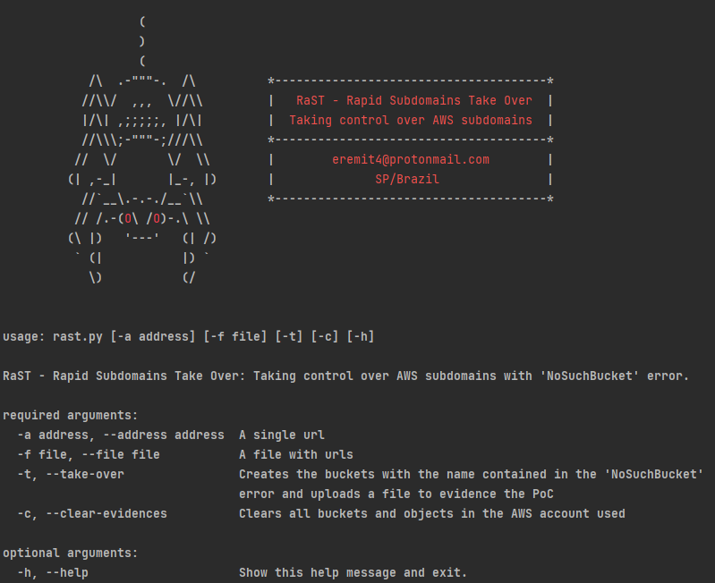

#  RaST - Rapid Subdomain Takeover

> This program is designed to create a proof of concept for the subdomain takeover vulnerability on pages hosted on AWS. The program checks if the "NoSuchBucket" error exists on the page and then creates a bucket with the same name and submits an index.html file for this bucket to consolidate the PoC.
> It is important to note that this program was created for a proof of concept. Any malicious action is the sole responsibility of the agent who performed it.

## 🕷️ Installing RaST

Clone the repository:

```bash
git clone https://github.com/eremit4/RaST.git
```

Install the libraries:

```bash
python -m pip install -r requirements.txt
```

## 🕶️ Prerequisites
Insert your AWS credentials in configs/config.json
```bash
{
  "ACCESS_KEY_ID": "",
  "SECRET_ACCESS_KEY": "",
  "REGION": ""
}
```

## 🕸️ Using RaST

Run the program:

```bash
python rast.py --help
```


## 📝 License

This project is under the [MIT License](LICENSE).
